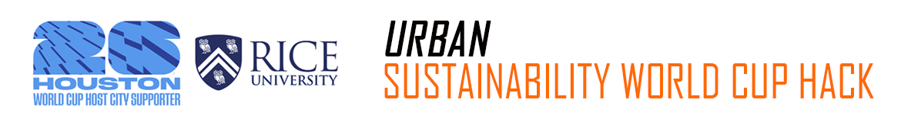
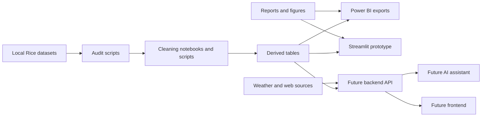
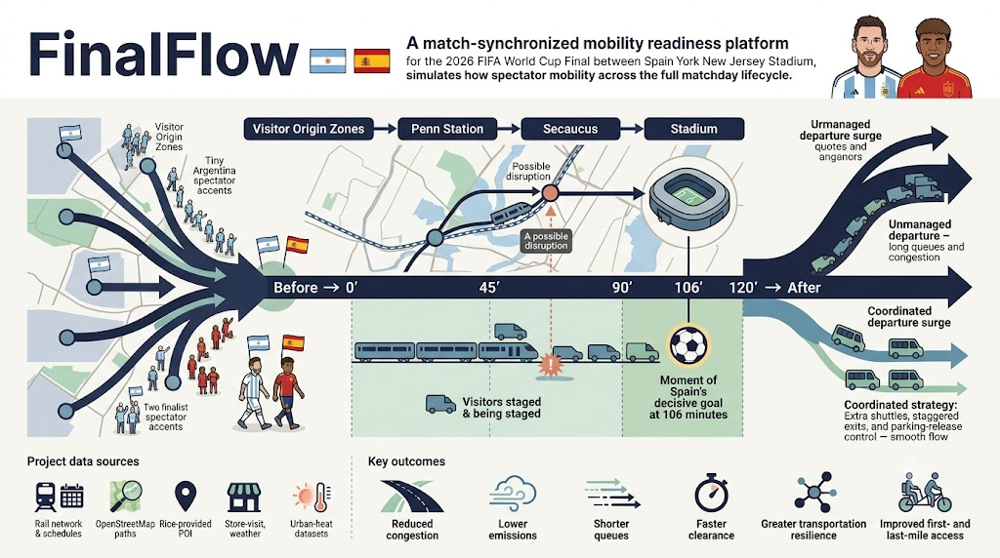

<p align="center">
  
</p>

# FinalFlow

**Match-synchronized mobility readiness for the 2026 World Cup Final.**

FinalFlow is a transportation and urban-sustainability project that studies how spectators, transit systems, roads, weather, commercial activity, and resilience planning interact before, during, and after a major match.

The case study replays the **2026 World Cup Final: Spain versus Argentina** at **New York New Jersey Stadium**, focused on the corridor:

```text
Midtown Manhattan -> New York Penn Station -> Secaucus Junction -> Meadowlands Station -> Stadium
```

## Tech Stack

Current and planned tools are shown separately so contributors can see what exists now and what will be added later.

**Current**


**Planned**


## Project Mission

FinalFlow helps the team evaluate:

- pre-match, in-match, and post-match crowd movement;
- rail, road, shuttle, parking, and pedestrian flow;
- first- and last-mile accessibility;
- congestion, queues, disruptions, and resilience strategies;
- weather and urban heat impacts;
- visitor spending, brand activity, and vendor placement;
- static and interactive visualizations;
- future AI assistant responses grounded in prepared project data.

## Current State

This repository currently contains:

- project documentation and team workstream guides;
- data and notebook folder conventions;
- Python script scaffolds;
- a working dependency-free data audit utility;
- a four-page, prepared-data Streamlit store-visit prototype in `paddydash/`;
- a reproducible synthetic scenario generator and clearly labeled scenario data.

It does **not** yet contain the standalone backend API, TypeScript frontend, restricted raw Rice datasets, or AWS deployment.

## Workflow Diagram



<p align="center">
  
</p>

## Repository Map

```text
.
├── asset/                  # README images and visual assets.
├── data/                   # Local data workspace and data policy.
├── docs/                   # Project, data, and handoff documentation.
├── notebooks/              # Contributor notebook workspaces.
├── paddydash/              # Existing Streamlit dashboard prototype.
├── reports/                # Figures, interactive outputs, and summaries.
├── scripts/                # Data, validation, visualization, and synthetic utilities.
└── tests/                  # Standard-library tests for implemented utilities.
```

## Quick Start

Run the existing Streamlit prototype:

```bash
python3 -m pip install -r paddydash/requirements.txt
streamlit run paddydash/app.py
```

Run the data audit utility on a local CSV:

```bash
python3 scripts/data/audit_data.py \
  --input /local/path/to/dataset.csv \
  --name store-visits-rice \
  --output reports/summaries/store_visits_audit.json
```

Run the lightweight test suite:

```bash
python3 -m unittest discover -s tests -v
```

## Documentation

- [Project overview](docs/project/project-overview.md)
- [Team workstreams](docs/project/team-workstreams.md)
- [Data contracts](docs/project/data-contracts.md)
- [Dataset layout](docs/data/dataset-layout.md)
- [Scripts guide](scripts/README.md)
- [Streamlit prototype guide](paddydash/README.md)
- [CI/CD beginner guide](docs/engineering/ci-cd-beginner-guide.md)
- [CI/CD and GitHub Actions guide](docs/engineering/ci-cd-guide.md)
- [AWS handoff template](docs/handoff/minh-tue-aws-handoff.md)

## Data Policy

Raw Rice datasets stay local unless the team explicitly approves a small public sample. Do not commit:

- `.env` files or secrets;
- OpenAI, SerpAPI, or AWS credentials;
- raw restricted datasets;
- large generated files;
- virtual environments, caches, or notebook checkpoints.

Use these standard data labels across reports, exports, notebooks, and future AI responses:

- `provided`
- `derived`
- `synthetic`
- `web`

## Team Flow

- **Phuong Anh** leads business analysis, Power BI, brand revenue, spending, and vendor-zone recommendations.
- **Duc Anh** leads Python auditing, cleaning, feature tables, modest synthetic scenarios, and exports.
- **Hai Nam** leads `store-visits-rice`, Streamlit prototype support, visualization, and future assistant UI work.
- **Tan Dat** leads `daily-weather-rice`, weather-risk indicators, future SerpAPI integration, and source-display testing.
- **Que Anh** leads `spend-patterns-rice`, `core-poi-geometry-rice`, `urban-heat-index-rice`, and spatial recommendation exports.
- **Minh Tue** receives the deployment handoff later when the app and services are ready for AWS planning.

## Branch Policy

Current shared setup work is on `stephen-develop`.

Do not create new branches, push raw data, or add deployment resources unless the team lead explicitly asks for that work.
