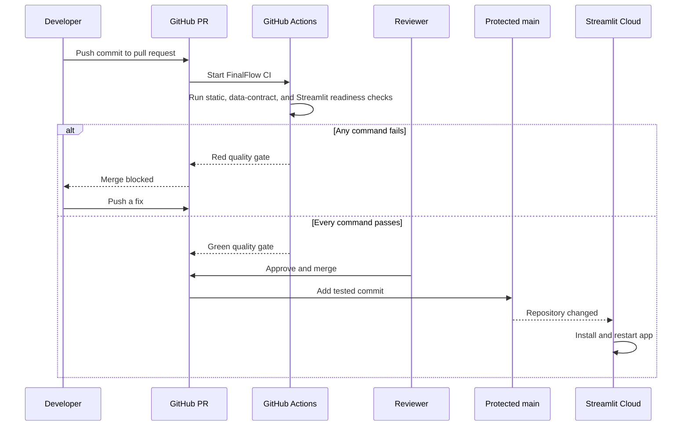

# FinalFlow CI/CD Beginner Guide

This guide assumes you are new to GitHub Actions, deployment, and CI/CD. It uses
the files that actually exist in FinalFlow, so you can read the explanation and
then inspect the real code beside it.

## 1. Start with the problem CI/CD solves

Without automation, a team member must remember to do all of this manually:

1. install the right Python version;
2. install dependencies;
3. look for code-quality errors;
4. run every test;
5. confirm deployment files exist;
6. review the change; and
7. update the hosted application.

People forget steps, local computers differ, and code that works on one machine
can fail on another. CI/CD turns the repeated parts into a documented machine-run
process.

For FinalFlow:

- **CI** asks, "Is this change safe enough to merge?"
- **CD** asks, "After it is merged, how does the tested version reach the hosted
  Streamlit application?"

## 2. The four systems involved

It helps to keep these systems separate:

| System | Purpose in FinalFlow |
|---|---|
| Git | Records commits and branches on your computer |
| GitHub | Stores the shared repository and pull requests |
| GitHub Actions | Creates a temporary computer and runs CI commands |
| Streamlit Community Cloud | Hosts and updates the web application |

GitHub Actions does not run inside your laptop. Streamlit does not review pull
requests. Each tool has one responsibility.

## 3. Essential vocabulary

### Repository

The project folder tracked by Git. This repository is `Bop95/RiceHack` on
GitHub.

### Commit

A saved snapshot of selected changes. A commit should represent one reviewable
idea, such as "add CI quality gate."

### Branch

An independent line of commits. You make changes on a working branch so the
shared deployment branch remains stable.

### Pull request (PR)

A request to review and merge one branch into another. A PR contains the code
diff, discussion, screenshots, and automated checks.

### Workflow

A YAML file under `.github/workflows/` that tells GitHub when and what to run.
FinalFlow's workflow is `.github/workflows/ci.yml`.

### Event or trigger

Something that starts a workflow, such as opening a pull request or pushing a
commit.

### Runner

The temporary computer used by GitHub Actions. FinalFlow requests
`ubuntu-latest`, so CI verifies the project on Linux even if development happened
on Windows.

### Job

A group of steps running on one runner. FinalFlow has three PR jobs:
`static-quality`, `mobility-data-contracts`, and `streamlit-readiness`.

### Step

One action or shell command inside a job, such as installing dependencies or
running tests.

### Action

A reusable GitHub Actions component. For example, `actions/setup-python` installs
the requested Python version.

### Quality gate

A check that must be green before merge. FinalFlow's visible PR checks are
**Static quality**, **Mobility data contracts**, and **Streamlit readiness**.

### Secret

A sensitive value such as an API key. Secrets must not appear in Git commits,
workflow files, screenshots, or logs.

## 4. The complete FinalFlow flow



The loop is intentional. A red result is feedback, not a disaster.

## 5. Understanding the actual workflow file

Open `.github/workflows/ci.yml` while reading this section.

### Workflow name

```yaml
name: FinalFlow CI
```

This is the name shown in GitHub's **Actions** tab.

### Triggers

```yaml
on:
  pull_request:
  push:
    branches:
      - main
  workflow_dispatch:
```

This means:

- `pull_request`: run whenever a PR is opened or updated;
- `push`: run when a commit reaches `main`; and
- `workflow_dispatch`: show a **Run workflow** button for maintainers.

Running on both PR and protected-branch push gives two useful checks: one before
merge and one on the exact merged commit.

### Token permissions

```yaml
permissions:
  contents: read
```

The workflow can read repository files but cannot push commits, approve PRs, or
publish releases. CI should have the smallest permission it needs.

### Concurrency

```yaml
concurrency:
  group: ${{ github.workflow }}-${{ github.ref }}
  cancel-in-progress: true
```

Imagine you push commit A and immediately notice a typo, then push commit B. CI
for A is now obsolete. GitHub cancels it and spends time on B instead.

Text inside `${{ ... }}` is a GitHub expression. Here it creates one concurrency
group for each workflow and branch or PR reference.

### Job definition

```yaml
jobs:
  quality-gate:
    name: Python 3.12 quality gate
    runs-on: ubuntu-latest
    timeout-minutes: 20
```

- `quality-gate` is the internal job ID.
- `name` is what reviewers see.
- `runs-on` requests a fresh Ubuntu runner.
- `timeout-minutes` stops a stuck job after 20 minutes.

### Safe CI environment

```yaml
env:
  FINALFLOW_DISABLE_OPENAI: "true"
  MPLBACKEND: Agg
  PYTHONUTF8: "1"
```

Important meanings:

- OpenAI is disabled so CI is deterministic, free of model-call charges, and
  does not need an API key.
- Matplotlib uses a non-graphical backend because the runner has no desktop.
- Python uses UTF-8 so multilingual test text is consistent.

The other variables disable optional usage/version messages that add noise to
logs.

### `uses` versus `run`

You will see two kinds of step:

```yaml
uses: actions/checkout@v7
```

`uses` calls a reusable action.

```yaml
run: python -m pip check
```

`run` executes a command in the runner's shell.

### Checkout

```yaml
- name: Check out repository
  uses: actions/checkout@v7
  with:
    persist-credentials: false
```

The runner starts empty. Checkout downloads the commit being tested.
`persist-credentials: false` removes the GitHub token from later Git operations
because this job never needs to push.

### Python and dependency cache

```yaml
- name: Set up Python 3.12
  uses: actions/setup-python@v7
  with:
    python-version: "3.12"
    cache: pip
```

Explicit Python versions make local, CI, and Streamlit behavior more consistent.
The pip cache avoids downloading unchanged packages on every run. A cache is only
a speed optimization; the requirements files remain the source of truth.

### Dependency installation

```yaml
run: python -m pip install -r requirements.txt -r requirements-dev.txt
```

- `requirements.txt` contains packages needed by the running application.
- `requirements-dev.txt` contains tools needed during development and CI, such as
  Ruff.

Keeping them separate means Streamlit does not install linting tools in the
production app.

### Dependency compatibility

```yaml
run: python -m pip check
```

This asks pip whether installed packages have incompatible requirements. It does
not replace application tests; it catches a different class of problem.

### Linting

```yaml
run: python -m ruff check paddydash scripts tests
```

Ruff detects issues such as undefined names, unused imports, and invalid import
placement. Its rules are configured in `pyproject.toml`.

A linter reviews code structure without running the whole application.

### Compilation preflight

```yaml
run: python -m compileall -q paddydash scripts tests
```

This compiles Python source to bytecode. It quickly catches syntax errors across
files, including files that a particular test run may not import.

### Deployment-bundle validation

```yaml
run: python scripts/validation/check_streamlit_deployment.py --require-tracked
```

This checks that:

- the Streamlit entrypoint exists;
- required pages, services, figures, and prepared CSVs exist;
- runtime requirements include important packages;
- restricted raw data and Parquet files are not tracked; and
- every required deployment file is committed to Git.

CI intentionally accepts prepared-data mode without an OpenAI key.

### Tests

```yaml
run: python -m unittest discover -s tests -v
```

`unittest` discovers files under `tests/`, runs each test method, and exits with a
non-zero status if anything fails. GitHub treats a non-zero command status as a
failed step and stops the job.

## 6. How GitHub decides red or green

Every command returns an **exit code**:

- `0` means success;
- any non-zero value means failure.

GitHub does not understand whether a chart is correct or an answer is sensible by
itself. It trusts the exit codes produced by Ruff, the deployment checker, and the
test suite.

This is why writing good tests matters: automation can only enforce rules that
the team has expressed in code.

## 7. Why CI uses a clean machine

Your computer may already contain:

- a package you forgot to add to `requirements.txt`;
- cached data;
- a local `.env` file;
- generated outputs; or
- an older Python configuration.

A fresh runner exposes hidden dependencies. If CI cannot build the project from
the committed files, another developer or deployment service may not be able to
build it either.

"It works on my machine" is therefore not enough. The stronger result is: "It
works from a clean checkout using documented commands."

## 8. Why branch protection matters

CI can report a failure, but branch protection turns that report into a rule.

Without protection:

1. CI becomes red.
2. Someone can still merge or push directly.
3. Streamlit may deploy the broken commit.

With protection:

1. CI becomes red.
2. GitHub blocks merge.
3. The developer must fix the failure.
4. Only a green change reaches the deployment branch.

A maintainer must enable this in GitHub Settings after the workflow has run once.
The required check is named **Python 3.12 quality gate**.

## 9. How CD works in this project

The current CD mechanism is managed by Streamlit Community Cloud.

One-time configuration tells Streamlit:

```text
Repository: Bop95/RiceHack
Branch: main
Entrypoint: paddydash/app.py
Python: 3.12
```

After that:

1. a reviewed PR is merged;
2. `main` receives the commit;
3. Streamlit notices the branch changed;
4. Streamlit downloads the new source;
5. it installs `requirements.txt`;
6. it starts `paddydash/app.py`; and
7. the hosted URL serves the new version.

GitHub Actions is the test gate. Streamlit is the deployment platform.

In CI/CD discussions, "CD" can mean continuous delivery or continuous
deployment. This project is continuously delivered after review, and Streamlit
automatically deploys commits that reach the watched branch.

## 10. Where the OpenAI key belongs

The key belongs only in server-side secret storage:

- local development: ignored `.env` file;
- hosted application: Streamlit Secrets settings.

It does not belong in:

- `ci.yml`;
- `requirements.txt`;
- Python source;
- tests or result JSON;
- PR descriptions;
- screenshots; or
- GitHub Actions logs.

Normal CI does not need the key because it tests deterministic prepared-data and
mocked-provider behavior. Live OpenAI testing is a separate, explicitly approved
manual activity because it is billable and nondeterministic.

## 11. Running the gate yourself

From the repository root in PowerShell:

```powershell
.\.venv\Scripts\python.exe -m pip install `
  -r requirements.txt -r requirements-dev.txt

$env:FINALFLOW_DISABLE_OPENAI = "true"
$env:MPLBACKEND = "Agg"

.\.venv\Scripts\python.exe -m pip check
.\.venv\Scripts\python.exe -m ruff check paddydash scripts tests
.\.venv\Scripts\python.exe -m compileall -q paddydash scripts tests
.\.venv\Scripts\python.exe scripts\validation\check_streamlit_deployment.py `
  --require-tracked
.\.venv\Scripts\python.exe -m unittest discover -s tests -v
```

Run commands one at a time while learning. Read each result before moving on.

The local order mirrors CI, which makes a GitHub failure easier to reproduce.

## 12. Reading a GitHub Actions failure

When the workflow is available on GitHub:

1. Open the pull request.
2. Select **Checks**.
3. Select **Python 3.12 quality gate**.
4. Find the first red step.
5. Expand its log.
6. Identify the command and the first useful error message.
7. Run that command locally.
8. Fix the cause, rerun locally, commit, and push.

Common examples:

| Red step | Likely cause | First action |
|---|---|---|
| Install dependencies | Invalid/unavailable package version | Inspect requirements change |
| `pip check` | Package version conflict | Read the named dependency conflict |
| Ruff | Unused import or undefined name | Open the reported file and line |
| Compile | Python syntax error | Open the first reported syntax location |
| Deployment validation | Required file missing/untracked | Run checker locally and inspect list |
| Tests | Behavior changed or regression | Run the named failing test locally |

Fix the application or test contract. Do not delete a failing check merely to get
a green badge.

## 13. Reading a Streamlit deployment failure

If CI is green but the hosted app fails:

1. open the Streamlit app settings and logs;
2. find the first application exception;
3. verify the branch and entrypoint are correct;
4. verify runtime packages are in root `requirements.txt`;
5. verify required prepared CSVs are committed;
6. verify secret names without printing their values; and
7. reproduce the startup command locally.

CI reduces deployment risk, but the hosted environment still needs a small smoke
check after deployment.

## 14. Safe beginner exercises

### Exercise 1: Read-only inspection

Open `.github/workflows/ci.yml` and identify:

- the three triggers;
- the runner operating system;
- the visible job name;
- the environment variable disabling OpenAI; and
- the final test command.

### Exercise 2: Run one check

Run:

```powershell
.\.venv\Scripts\python.exe -m ruff check paddydash scripts tests
```

Find the exit code:

```powershell
$LASTEXITCODE
```

It should be `0` when linting passes.

### Exercise 3: Run one test module

```powershell
.\.venv\Scripts\python.exe -m unittest tests.test_ci_configuration -v
```

Notice how every test has a name describing the behavior it protects.

### Exercise 4: Observe a real PR run

After the workflow is pushed:

1. open its first PR;
2. watch each step change from queued to running to complete;
3. open the logs even when green; and
4. compare the GitHub commands with the local commands above.

Do not intentionally break the shared branch for practice. If the team wants a
failure demonstration, use a disposable teaching branch and a clearly temporary
test change reviewed by a maintainer.

## 15. Frequently asked questions

### Does CI deploy the app?

Not directly. CI verifies the change. Streamlit Community Cloud observes the
protected branch and deploys it.

### Why test again after merging?

The merge commit can differ from the exact feature-branch commit, especially when
multiple PRs change nearby code. Testing the protected branch confirms its actual
state.

### Why not run CI only on `main`?

PR checks provide feedback before merge. A check only after merge is too late to
protect the branch.

### Why use Linux when development is on Windows?

Streamlit hosting uses a Linux environment. Cross-platform CI catches path,
capitalization, and dependency assumptions earlier.

### Why is there only one job?

The current test suite is small. One job installs dependencies once and finishes
quickly. When linting, security analysis, and tests become slower, they can be
split into parallel jobs.

### Is a green CI result proof that the app has no bugs?

No. It proves that the automated checks passed for one commit. Manual review,
data interpretation checks, security judgment, and hosted smoke testing still
matter.

### Why not store the OpenAI key as a GitHub Actions secret?

This workflow does not need it. A secret that is never provided cannot leak from
the CI job, and deterministic tests are more reliable for every PR.

### What is rollback?

Rollback means returning production to a known-good version. For this prototype,
the safe process is a reviewed Git revert. When the revert reaches the watched
branch, Streamlit deploys the restored code.

## 16. What you should be able to explain afterward

You understand the pipeline when you can answer these questions in your own
words:

1. What event starts CI?
2. Where does the runner come from?
3. Why does CI install dependencies from scratch?
4. What is the difference between Ruff, compilation, and tests?
5. Why is OpenAI disabled in normal CI?
6. What converts a green check into a merge requirement?
7. Which branch does Streamlit watch?
8. Where does the production API key live?
9. What do you do when a step becomes red?
10. How would the team roll back a bad deployment?

If you can explain those ten answers, you understand the core CI/CD workflow used
by this project.

## 17. Related repository files

- `.github/workflows/ci.yml` — automation definition
- `requirements.txt` — production Python dependencies
- `requirements-dev.txt` — development and CI tools
- `pyproject.toml` — Ruff configuration
- `scripts/validation/check_streamlit_deployment.py` — deployment bundle checker
- `tests/test_ci_configuration.py` — workflow safety tests
- `paddydash/DEPLOYMENT_GUIDE.md` — hosted application procedure
- `docs/engineering/ci-cd-guide.md` — maintainer-oriented operational guide
