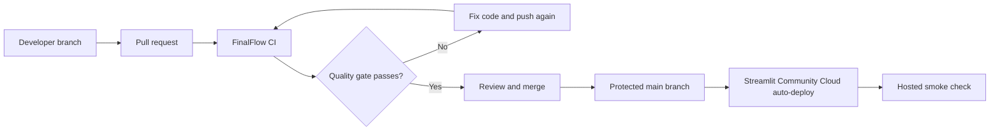

# FinalFlow CI/CD Guide

This guide explains the repository's first CI/CD pipeline, what is automated,
what still needs a maintainer to configure, and how the pieces fit together.

If GitHub Actions and deployment terminology are new to you, begin with the
[CI/CD beginner guide](ci-cd-beginner-guide.md), then return here for the
maintainer checklist.

## 1. The short mental model

- **Continuous Integration (CI):** every pull request is checked in a clean
  machine before it can be merged.
- **Continuous Delivery (CD):** after approved code reaches the branch watched
  by Streamlit Community Cloud, the hosted app updates automatically.
- **Pipeline:** the ordered set of checks and delivery steps.
- **Quality gate:** a required CI result that must pass before merge.

For FinalFlow, the intended flow is:



The repository does not need a packaged release artifact for the current app.
Streamlit Community Cloud deploys the tracked Python source, requirements, and
compact prepared-data files directly from GitHub.

## 2. How the referenced tutorial maps to this repo

The referenced Medium tutorial demonstrates the right concepts: store workflows
under `.github/workflows`, trigger them from pull requests, run checks, gate later
steps with earlier results, inspect logs, and add branch protection.

Its sample should not be copied literally here:

| Tutorial example | FinalFlow equivalent |
|---|---|
| Node.js 16 | Python 3.12 |
| `npm install` | `python -m pip install` |
| `npm run lint` | Ruff |
| `npm test` | `unittest discover` |
| JavaScript CodeQL | Optional Python CodeQL default setup |
| Build `dist/` artifact | Validate the Streamlit deployment bundle |
| GitHub prerelease asset | Streamlit Community Cloud auto-deployment |
| PR token with write access | Read-only `contents` permission |

The tutorial uses older action versions and grants write permission so it can
create releases. FinalFlow's PR workflow does not publish releases, so it uses
the least privilege needed: `contents: read`.

## 3. What has been added

### `.github/workflows/ci.yml`

The workflow runs on:

- every pull request;
- pushes to `main`; and
- manual runs from GitHub's Actions tab.

It uses three independent `ubuntu-latest` pull-request checks. All use Python
3.12, install the declared application and CI dependencies, and keep provider
calls disabled:

1. **Static quality**: `pip check`, Ruff, and compilation.
2. **Mobility data contracts**: regenerates the synthetic mobility inputs,
   derived outputs, and dashboard context in the runner's temporary directory,
   then runs their deterministic contract tests.
3. **Streamlit readiness**: validates the strict tracked deployment bundle and
   runs the complete standard-library test suite.

The temporary data check never rewrites tracked data files. It catches a broken
generator/export chain before the app is reviewed.

The workflow cancels an older run when a newer commit is pushed to the same PR.
This saves Actions minutes and ensures reviewers see the newest result.

### `requirements-dev.txt`

CI-only tools are separated from the application dependencies. Streamlit does
not need to install Ruff in production.

### `pyproject.toml`

Ruff's Python version and baseline rules are explicit, so a future Ruff release
cannot silently change which rules the repository enforces.

### `tests/test_ci_configuration.py`

These tests protect the pipeline itself. They check that the workflow stays
read-only and secret-free, uses Python 3.12, disables live OpenAI calls, and keeps
the required quality-gate commands.

## 4. Run the same gate locally

From the repository root on PowerShell:

```powershell
.\.venv\Scripts\python.exe -m pip install `
  -r requirements.txt -r requirements-dev.txt

$env:FINALFLOW_DISABLE_OPENAI = "true"
$env:MPLBACKEND = "Agg"

.\.venv\Scripts\python.exe -m pip check
.\.venv\Scripts\python.exe -m ruff check paddydash scripts tests
.\.venv\Scripts\python.exe -m compileall -q paddydash scripts tests
.\.venv\Scripts\python.exe scripts\validation\check_streamlit_deployment.py `
  --require-tracked
.\.venv\Scripts\python.exe -m unittest discover -s tests -v
```

On Linux or macOS, replace the interpreter path with `python` after activating
the virtual environment.

Do not run `run_live_openai_tests.py` in normal CI. Live model tests are billable,
nondeterministic, and require a secret. Keep them as explicitly approved manual
release checks.

## 5. First push and pull request

The workflow file only starts running after it is committed and pushed to GitHub.
The recommended first rollout is:

1. Review the exact staged file list and confirm no `.env`, secret TOML, raw data,
   Parquet, or unrelated contributor work is included.
2. Commit the CI workflow, configuration, tests, and documentation on the current
   feature branch.
3. Push the branch and open a pull request into the team-selected integration
   branch.
4. Open the PR's **Checks** tab and inspect **Static quality**, **Mobility data
   contracts**, and **Streamlit readiness**.
5. If a check fails, open its log, fix the cause locally, and push again. GitHub
   automatically starts a new run.

Do not bypass a red check just to trigger a deployment.

## 6. One-time GitHub repository settings

A repository maintainer must configure these in GitHub; files in a branch cannot
enable their own protection rules.

### Actions permissions

In **Settings → Actions → General**:

1. Allow GitHub Actions for the repository.
2. Allow actions created by GitHub. The workflow currently uses only
   `actions/checkout` and `actions/setup-python`.
3. Set workflow permissions to read repository contents by default.
4. Do not enable "Allow GitHub Actions to create and approve pull requests" for
   this pipeline.

### Protect the deployment branch

In **Settings → Rules → Rulesets** (or Branch protection rules), create a rule
for the branch Streamlit watches. FinalFlow uses `main` as the shared integration
and deployment branch.

Recommended settings:

- require a pull request before merging;
- require at least one approving review if the team has enough reviewers;
- require conversation resolution;
- require status checks to pass;
- select **Static quality**, **Mobility data contracts**, and **Streamlit
  readiness** after their first GitHub runs appear;
- require branches to be up to date before merging;
- block force pushes and branch deletion; and
- limit bypass permission to the smallest maintainer group.

Branch protection is what makes CI a gate. Without it, someone can push broken
code directly to the branch and Streamlit may deploy it.

### Optional security automation

After the basic workflow is green, a maintainer can enable:

- Dependabot version updates for `pip` and GitHub Actions;
- GitHub secret scanning and push protection; and
- CodeQL **default setup** for Python if it is available for the repository's
  visibility and GitHub plan.

Use GitHub's default CodeQL setup rather than copying the tutorial's JavaScript
advanced workflow. The current CI intentionally remains portable if Advanced
Security is unavailable.

## 7. Streamlit Community Cloud CD setup

The current deployment target is Streamlit Community Cloud. A maintainer with
GitHub access performs this once:

1. Sign in at `share.streamlit.io` with GitHub.
2. Create an app from repository `Bop95/RiceHack`.
3. Select the protected deployment branch, `main`.
4. Set the entrypoint to `paddydash/app.py`.
5. Select Python 3.12.
6. Deploy initially in prepared-data mode if desired.
7. Put production values in Streamlit's **Secrets** settings, never in GitHub or
   the workflow:

```toml
OPENAI_API_KEY = "replace-in-streamlit-settings"
OPENAI_MODEL = "gpt-5"
FINALFLOW_MAX_AI_REQUESTS_PER_SESSION = "10"
```

After setup, Streamlit watches the selected GitHub branch. A merged commit is
detected and reflected in the hosted app automatically; dependency changes cause
a full rebuild.

GitHub Actions and Streamlit secrets are separate systems. This CI does not need
`OPENAI_API_KEY`, and adding it would make pull-request testing riskier without
improving deterministic coverage.

## 8. Post-deployment smoke check

After each accepted deployment, verify in a private browser window:

1. Overview loads its prepared metrics and charts.
2. Store-Visit Explorer filters work.
3. Scenario Explorer retains the synthetic label.
4. Ask FinalFlow shows either configured secure mode or the expected prepared-data
   fallback.
5. One approved question returns answer, evidence, data label, limitation, and
   related chart.
6. An out-of-scope or prompt-injection question is declined.
7. No API key or backend exception appears in the UI or logs.

If live OpenAI is enabled, keep this smoke check small and monitor project usage.

## 9. Failure and rollback flow

### CI failure before merge

Read the failed step in the PR Checks tab, reproduce the same command locally,
fix it, and push another commit. Do not change the workflow merely to hide an
application failure.

### Deployment failure after merge

1. Read Streamlit Community Cloud logs.
2. Check that tracked requirements and prepared CSVs exist.
3. Check Streamlit secrets without printing their values.
4. If a quick forward fix is unsafe, revert the bad commit through a pull request.
5. Streamlit will detect the revert on the watched branch and redeploy it.

### OpenAI outage

The application should continue in prepared-data fallback mode. An OpenAI outage
does not justify bypassing local evidence or exposing a key in CI.

## 10. What is deliberately not automated yet

- AWS resources: the repository's AWS handoff remains future planning.
- Live OpenAI tests on every PR: they are manual because of cost, secrets, and
  nondeterminism.
- Automatic GitHub releases: the current Streamlit delivery model does not
  consume release artifacts.
- Production rollback buttons or canary deployments: use reviewed Git reverts for
  this prototype.
- Global AI rate limiting and user authentication: required before sustained
  public traffic.

These can become later pipeline stages when the deployment architecture exists.

## 11. Definition of done

The first CI/CD rollout is complete when:

- the workflow is committed and visible in GitHub's Actions tab;
- a pull request shows all three PR checks as green;
- the deployment branch requires that status check;
- Streamlit Community Cloud watches the protected branch;
- deployment secrets exist only in Streamlit settings;
- a post-deployment smoke check passes; and
- the pull request includes its test evidence and screenshots.

## References

- [Referenced introductory pipeline tutorial](https://brandonkindred.medium.com/creating-your-first-ci-cd-pipeline-using-github-actions-81c668008582)
- [GitHub: Building and testing Python](https://docs.github.com/en/actions/tutorials/build-and-test-code/python)
- [GitHub: Controlling workflow concurrency](https://docs.github.com/en/actions/how-tos/write-workflows/choose-when-workflows-run/control-workflow-concurrency)
- [GitHub: Secure use reference](https://docs.github.com/en/actions/reference/security/secure-use)
- [Streamlit: Deploy an app on Community Cloud](https://docs.streamlit.io/deploy/streamlit-community-cloud/deploy-your-app/deploy)
- [Streamlit: Manage and update an app](https://docs.streamlit.io/deploy/streamlit-community-cloud/manage-your-app)
