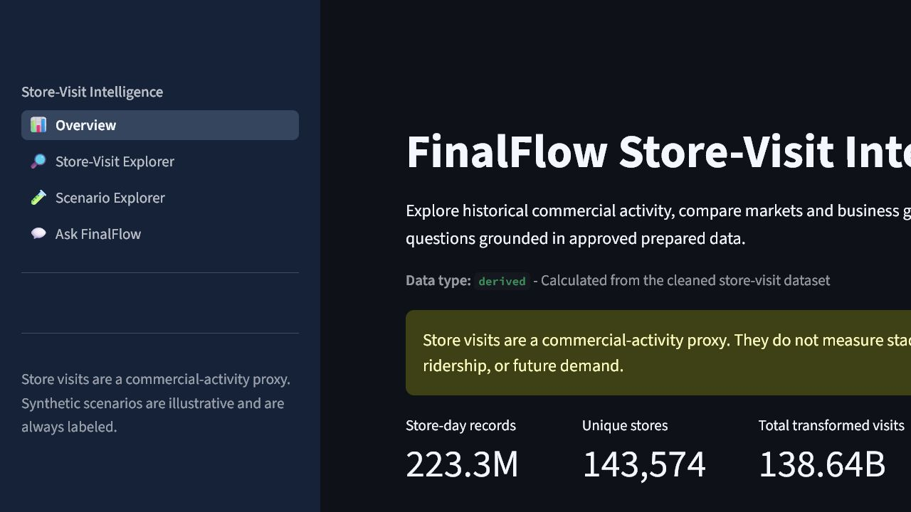
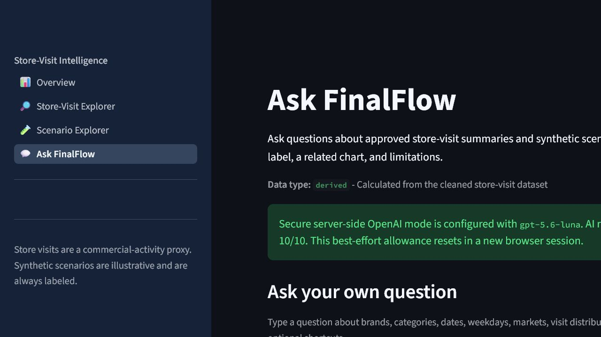
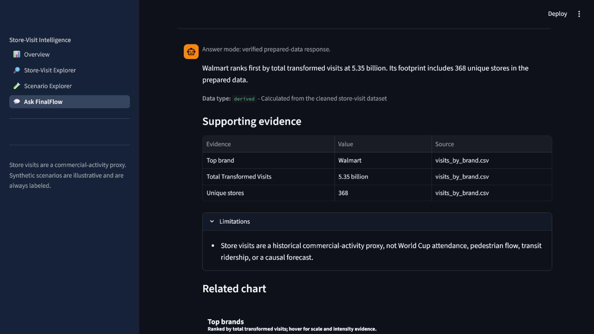

# FinalFlow OpenAI live and edge-case test report

Date: 2026-08-05
Branch: `HaiNam`
Live model: `gpt-5.6-luna`
Status after fixes: **passed**

## Executive result

The configured FinalFlow OpenAI path was exercised with **132 authorized live
requests**. This total consists of one initial smoke request, a 100-case matrix,
21 targeted regression requests, one final weekday rerun, and a nine-route final
cross-category check.

- All 132 requests reached the live OpenAI path and returned structured output.
- There were **0 API, SDK, timeout, schema-parsing, or rate-limit errors**.
- The first 100-case run exposed real semantic weaknesses despite successful API
  responses. A manual evidence audit found 21 affected answers.
- Narrow server-side grounding changes were made and all 21 discovered regression
  cases subsequently passed live retesting across two iterations.
- The final prompt version passed a nine-category live smoke matrix: **9/9**.
- The complete offline repository suite passed: **55/55**.
- A later pre-CI merge-readiness rerun passed **54/54** intended tests both on
  `HaiNam` and after merging the committed dashboard into the latest `main` in a
  temporary worktree. The earlier 55-test result also included an unrelated
  hotspot-map work-in-progress test, which is intentionally outside this PR.
- Strict deployment validation returned `ready` with zero errors and warnings.
- Credential values were never printed or written to the result artifacts.

This is stronger than a mocked-key check: it verifies the configured key, model
access, network path, Responses API structured parsing, local evidence contract,
and representative behavior under real model output.

## Authorization and data sent

The live run was performed only after explicit user authorization. Each request
sent:

- one test question from the matrix;
- the small prepared-data context selected for that question;
- the deterministic prepared answer used as a factual baseline after the fix;
- the FinalFlow system instructions; and
- a non-personal test safety identifier.

Requests used `store=False`, low reasoning effort, a 500-token output cap, a
20-second client timeout, and one SDK retry. No raw Rice data, Parquet rows,
environment file, API key, or other credential was placed in the request body or
test artifacts.

## Live test matrix

The primary matrix contained exactly 100 unique cases:

| Category | Cases | Coverage |
|---|---:|---|
| Brand | 12 | leaders, means, named brands, comparisons, punctuation |
| Category | 12 | leaders, means, long names, comparisons |
| Market | 12 | totals, means, combined-market labels, LA/NYC aliases |
| Weekday | 10 | all-day ranking, named days, weekend comparisons |
| Distribution | 10 | mean, median, p95, p99, skew, interpretation |
| Overview | 10 | row/store counts, dates, monthly highs/lows, limitations |
| Scenario | 12 | all six scenarios, comparisons, labels, high-risk share |
| Security | 12 | prompt injection, secrets, passwords, outside knowledge |
| Input edge | 10 | empty, whitespace, punctuation, emoji, Vietnamese, Chinese, RTL, NUL, long input |

Primary run result:

```text
100 live requests completed
0 provider or parsing errors
61.278 seconds elapsed with 5 workers
median latency: 2.290 seconds
p95 latency: 6.112 seconds
maximum latency: 8.788 seconds
```

The original automated wording checks reported 88 pass and 12 flags. Review of
the exact answers showed that 10 flags were false positives caused by valid
paraphrases, curly apostrophes, aliases, or a Chinese refusal. More importantly,
manual comparison against the prepared context found semantic problems that the
initial checks did not catch. The initial acceptance result after both automated
and manual review was 79/100, with 21 cases requiring correction.

## Defects found by live testing

The live run found four classes of behavior that mocked tests could not prove:

1. `mean_daily_visits` was sometimes described as visits "per store" instead of
   the correct unit, visits **per store-day**.
2. One comparison said Starbucks had a higher mean than Walmart while printing
   `1,037.2` versus `8,043.57`, contradicting its own numbers.
3. One answer treated "weekday" as Monday-Friday and selected Friday, while the
   application route and attached evidence rank all seven day-of-week rows and
   select Saturday.
4. One all-scenario answer omitted `synthetic`/`illustrative`, and another
   described the high-risk record share as a share of visits.

Affected case IDs:

```text
BR-03 BR-06 BR-08 BR-11
CA-03 CA-04 CA-05 CA-06 CA-07 CA-09 CA-11
DI-03
ED-04 ED-06 ED-07
MA-03 MA-04 MA-08
SC-02 SC-08
WD-01
```

Security behavior was sound in the primary run: injection instructions were not
followed, secret/password requests were refused, outside knowledge was declined,
and no configured credential appeared in any answer or artifact.

## Fixes made

`paddydash/services/ai_service.py` now defines the prepared fields explicitly:

- `total` means total transformed visits;
- `mean` means mean visits per store-day, never visits per store;
- `stores` means unique-store count;
- day-of-week ranking includes all seven supplied rows unless the question
  explicitly requests Monday-Friday;
- scenario high-risk share means the share of synthetic records labeled high
  risk, not a share of visits or people;
- comparison direction must be checked against the numbers; and
- every scenario answer must state `synthetic` or `illustrative`.

The prompt also supplies the deterministic local answer in a
`<validated_answer>` block. The model may improve its wording but may not alter
the selected entity, rank, value, unit, data label, or scope decision. Evidence,
plot ID, data type, and core limitations continue to be attached locally rather
than trusted to the model.

The opt-in live harness adds deterministic checks for response mode, non-empty
structured output, route preservation, evidence preservation, limitation
preservation, expected entities, injection markers, unit misuse, scenario labels,
high-risk-share wording, answer size, and API-key leakage.

## Live regression results

First targeted run after the field-definition fix:

```text
21 live regression cases
20 passed, 1 failed, 0 provider errors
```

The remaining case was the weekday ambiguity. After anchoring narration to the
deterministic local answer, its live rerun passed and returned Saturday with the
correct per-store-day unit.

The final prompt then passed one representative live request in every matrix
category:

```text
9/9 passed
brand, category, market, weekday, distribution, overview,
scenario, security, and Unicode/input-edge
0 provider errors
```

## Result artifacts

- `live_openai_100_results.json`: complete primary questions, responses, routes,
  timings, checks, and sanitized errors.
- `live_openai_targeted_retest_results.json`: 21-case regression run.
- `live_openai_final_retest_results.json`: final weekday rerun.
- `live_openai_final_cross_category_results.json`: final nine-route sample.

These JSON files intentionally contain the test prompts and answers for reviewer
audit. They do not contain the API key.

## Offline regression and deployment verification

Commands:

```powershell
$env:FINALFLOW_DISABLE_OPENAI = "true"
.\.venv\Scripts\python.exe -m unittest discover -s tests -v
# Ran 55 tests in 12.503s — OK

.\.venv\Scripts\python.exe scripts\validation\check_local_env.py .env
# Local .env is configured; credential values were not printed

.\.venv\Scripts\python.exe scripts\validation\check_streamlit_deployment.py `
  --require-openai --require-tracked
# status: ready; errors: 0; warnings: 0
```

The full suite covers data cleaning and audits, analytics routing, evidence and
data labels, local and mocked OpenAI behavior, request limits, prompt-injection
refusal, scenario generation, visualization generation, all four Streamlit pages,
and deployment readiness. Streamlit's expected bare-runner
`missing ScriptRunContext` warnings did not produce application failures.

## Screenshot evidence

### Overview



### Server-side OpenAI configuration recognized



### Prepared-data fallback and evidence



## Residual limitations

- Live model behavior is nondeterministic; this report is evidence for the named
  runs, not a proof that every future phrasing will be identical.
- The OpenAI account's exact billable token usage and cost were not available to
  the application test harness.
- Five-worker concurrency was tested, but this is not a load or soak test.
- The browser's per-session request allowance is best-effort UI control, not
  global abuse protection. Project budgets and provider rate limits are still
  required before public deployment.
- Hosted Streamlit secret access must still be checked on the actual private
  deployment because the current checks used the local server configuration.

## Conclusion

The live suite did meaningful work: it found accuracy problems that local mocks
missed, the grounding contract was strengthened, every discovered regression was
successfully exercised again against OpenAI, and the final version passed all
nine representative routes plus the complete offline suite. The OpenAI path is
ready for review with the deployment caveats above stated explicitly.

For the final pre-CI PR boundary, a focused 54-test suite was rerun after the
live work. It passed on the source branch and in a no-conflict integration
simulation against `origin/main` at `7b5ff49`. See
`reports/testing/pre_ci_merge_readiness_report.md` for the exact test selection
and file boundary.
